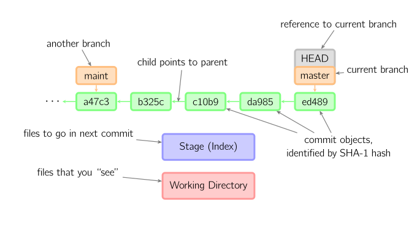

## git基本原理与使用技巧
<!-- .slide: class="center" -->
------ 孟来俊 <!-- .element: style="text-align: right;" -->


## 个人介绍
* 清华大学计算机系
* 商汤科技基础架构部


## 个人介绍
* 基础算法与数据结构（动态规划，平衡树，网络流 等）
* 大规模分布式系统（hadoop，k8s，ceph，cassandra，golang 等）
* 工程效率与技术工具（CI/CD，git，tmux，vim，emacs 等）


## git基本概念
* 分布式版本控制系统
* 每个仓库都是独立的，有全部版本控制数据
 <!-- .element: style="max-width: 60%;" -->


## git基本概念
* workspace: 工作区除.git目录以外的其他文件
* repository: .git目录为仓库内容 
* stage: 准备下一次提交的文件
* commit history: 在版本历史中记录了每一次提交


## git基本概念
 <!-- .element: style="max-width: 50%;" -->


## git基本概念



## git基本操作
* 配置与查看用户信息`~/.gitconfig`
```
git config --global user.name
git config --global user.email
git config --global color.ui auto
git config --global core.editor vim
```


## git基本操作
* 查看当前workspace的状态
```bash
git status
```
- staged: 等待提交的文件
- modified: 被修改过的文件
- untracked: 没有被版本控制的文件


## git基本操作
* 查看当前commit history的状态
```bash
git log
git log --decorate=full
```
- commit: 提交
- branch: 分支
- tag: 标签


## git基本操作
* 添加文件到stage
```bash
git add index.js
```
* 删除并untrack文件
```bash
git rm index.js
```
* `.gitignore`文件
```
.DS_Store
node_modules
dist
.python-version
```


## git基本操作
* [练习尝试](https://git-school.github.io/visualizing-git)
* 提交当前修改
```bash
git commit
git commit -a -m "注释"
```
* 查看一个提交的内容，每个提交记录的是一系列diff
```bash
git show 7f88c4aa1a9d8162f5a37b765305a8b6e0d03e03
```


## git基本操作
* 从远程拉所有仓库信息到本地
```bash
git fetch
```
* 从远程拉所有仓库信息到本地，然后merge当前分支的远程修改
```bash
git pull
git fetch + git merge origin/current_branch
```


## git基本操作
* 把当前分支的本地信息推到远程仓库
```bash
git push
```
* 把当前分支的本地信息推到远程仓库，并设置默认远端分支
```bash
git push --set-upstream origin develop
```
* `.git/config`文件
```
[remote "origin"]
  url = git@code.snowplus.cn:snow-admin/snow-admin-fe.git
  fetch = +refs/heads/*:refs/remotes/origin/*
[branch "develop"]
  remote = origin
  merge = refs/heads/develop
```


## git基本操作
* 查看所有分支
```bash
git branch -a
```
* 转移到指定分支
```bash
git checkout develop
```
* 区分develop, origin/develop, 远程仓库develop


## git使用技巧
* 开始一个新功能的开发，需要新建一个分支
```
git branch feature/mlj/xxx
git checkout feature/mlj/xxx
```
```
git checkout -b feature/mlj/xxx
```


## git使用技巧
* 需要删除一个分支
```
git branch -d feature/mlj/xxx
git branch -D feature/mlj/xxx
```
* 需要删除一个远程分支
```
git push origin :feature/mlj/xxx
// 1.7.0之后
git push origin --delete feature/mlj/xxx
```


## git使用技巧
* 需要发布版本了，打一个tag
```
git tag v1.2.0
git push --tags
```
* tag，branch，HEAD的区别？


## git使用技巧
* HEAD是当前workspace
* HEAD~
* HEAD~3
```
git diff HEAD~3
```


## git使用技巧
* 与他人合作时需要merge代码
```bash
git merge develop
```
* 处理冲突
```bash
<<<<<<< HEAD
Creating a new branch.
=======
Creating a new Branch.
>>>>>>> develop
```


## git使用技巧
* 想要最终commit历史是一条直线
```bash
git rebase develop
```
* 和merge有什么区别呢？


## git使用技巧
* 发现一个bug！想定位bug的代码位置！想知道是谁写的！
```bash
git diff v1.0.0
git log index.html
git blame index.html
git show c2bb245d030c2dec101164f1bf5cc995908ae5ae
```
```bash
git diff master index.html
git log master index.html
git blame master index.html
```


## git使用技巧
 <!-- .element: style="max-width: 60%;" -->
```
git diff
git diff --cached
git diff HEAD
git diff maint
git diff b325c da985
```


## git使用技巧
* 想回滚一个代码提交
```bash
git revert b893b1568464d2ec3ad11927291ac01b32c295c7
```
* 提交错了，黑历史不想被看到（个人分支才能这样！）
```bash
git reset b893b1568464d2ec3ad11927291ac01b32c295c7
git push -f
git reset --hard b893b1568464d2ec3ad11927291ac01b32c295c7
```


## git使用技巧
 <!-- .element: style="max-width: 60%;" -->
```
git reset -- files
git checkout -- files
git commit
git add files 
``` 


## git使用技巧
 <!-- .element: style="max-width: 60%;" -->
```
git checkout HEAD -- files
git commit files
```
```
git checkout branch_name -- files
```


## git使用技巧
* 功能开发到一半，突然有临时需求要修bug
```bash
git stash
git checkout develop
# 进行其他工作...
git checkout feature/mlj
git stash list
git stash pop
```
* WIP(Work In Progress)：开发中


## git使用技巧
* 想要拿一个单独的commit到当前分支
* 新版本修复了一个bug，但不想更新版本
* 其他分支修复了一个bug，但不想要其他分支别的内容
```
git cherry-pick c2bb245d030c2dec101164f1bf5cc995908ae5ae
```


## git使用技巧
* 两个人在一个分支合作，想要让提交历史清晰
```bash
git pull --rebase
git fetch + git rebase origin/current_branch
git pull
git fetch + git merge origin/current_branch
```


## git使用技巧
* rebase时是一个一个提交进行冲突处理
```
git rebase --continue
git commit
git rebase --abort
```


## git使用技巧
* git仓库越来越大？清理孤立提交，优化本地仓库存储
```bash
git gc --prune=now
```
* 什么是孤立提交？
* 什么是git-lfs？


## 一些建议
* 每个commit记录一件独立的事情（方便之后blame！）
* commit之前先跑过test与lint，并进行代码review（`git diff HEAD`）
* 每天都把工作内容进行提交，并且push到远程仓库（清空workspace，整理一天工作，备份代码）


# 谢谢大家！
<!-- .slide: class="center" -->
